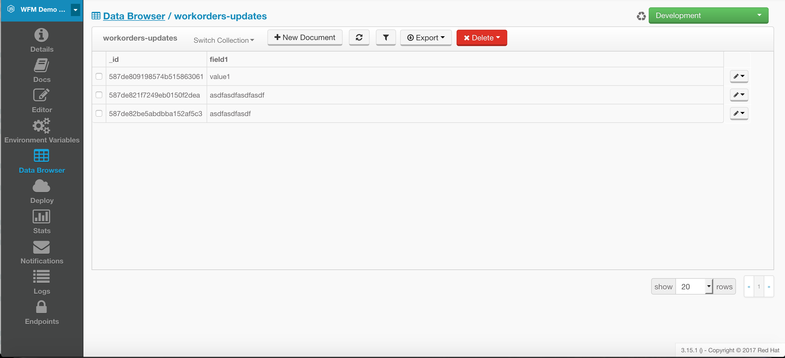
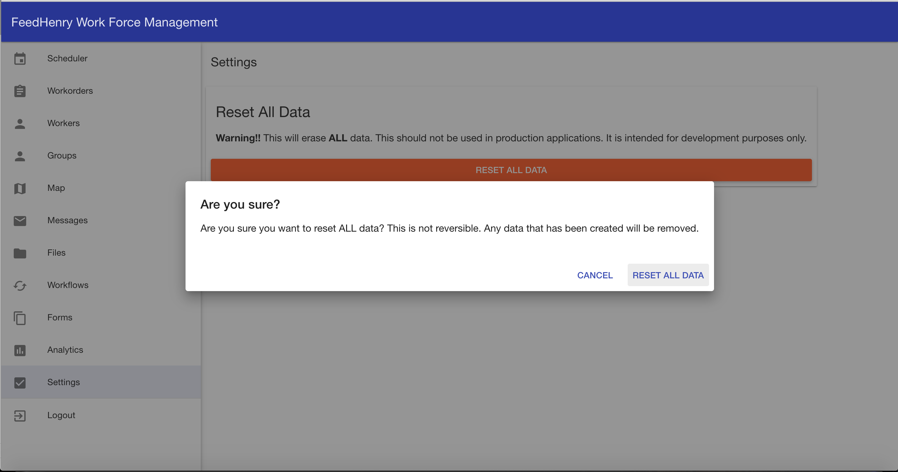

<!-- START doctoc generated TOC please keep comment here to allow auto update -->
<!-- DON'T EDIT THIS SECTION, INSTEAD RE-RUN doctoc TO UPDATE -->
**Table of Contents**

- [Use Simple Perstistence Store](#use-simple-perstistence-store)
- [Overview](#overview)
  - [Example: Use Simple Perstistence Store for workorders in Cloud App](#example-use-simple-perstistence-store-for-workorders-in-cloud-app)
    - [Create list of of workorders to be saved into Simple Store](#create-list-of-of-workorders-to-be-saved-into-simple-store)
    - [Create Simple Store in your Cloud App](#create-simple-store-in-your-cloud-app)
    - [Registering CRUD topics for the workorders](#registering-crud-topics-for-the-workorders)
    - [Publishing a create topic to create the workorders](#publishing-a-create-topic-to-create-the-workorders)
  - [Option to switch between memory store and persistence one](#option-to-switch-between-memory-store-and-persistence-one)
  - [Removing data from the data browser in the deployed raincatcher-demo-cloud and raincatcher-demo-auth applications](#removing-data-from-the-data-browser-in-the-deployed-raincatcher-demo-cloud-and-raincatcher-demo-auth-applications)
  - [Resetting a persistent storage raincatcher project](#resetting-a-persistent-storage-raincatcher-project)

<!-- END doctoc generated TOC please keep comment here to allow auto update -->

# Use Simple Perstistence Store

# Overview
- This is a new module raincatcher-store-simple that will
    - use current functionality in the mediator ArrayStore 
    - use the [$fh.db Cloud API](https://access.redhat.com/documentation/en/red-hat-mobile-application-platform-hosted/3/paged/cloud-api/chapter-2-fhdb) to store data in a mongo database
 - Allow users to control whether the memory store or the MongoDB store is used

## Example: Use Simple Perstistence Store for workorders in Cloud App

### Create list of of workorders to be saved into Simple Store 
```js
var workorders = [
    { id: "rkX1fdSH", workflowId: 'SyVXyMuSr', assignee: 'rkX1fdSH', type: 'Job Order', title: 'Footpath in disrepair', status: 'New', startTimestamp: '2015-10-22T14:00:00Z', address: '1795 Davie St, Vancouver, BC V6G 2M9', location: [49.287227, -123.141489], summary: 'Please remove damaged kerb and SUPPLY AND FIX 1X DROP KERB CENTRE BN 125 X 150 cart away from site outside number 3.'},
  ...
    { id: "BkuXajsIB", workflowId: 'SyVXyMuSr', assignee: null, type: 'Job Order', title: 'Sink in disrepair', status: 'New', startTimestamp: '2015-10-22T07:00:00Z', address: '3820 Oak St, Vancouver, BC V6H 2M5', location: [49.251362, -123.127070], summary: 'Please remove damaged kerb and SUPPLY AND FIX 1X DROP KERB CENTRE BN 125 X 150 cart away from site outside number 3.'};
];
```

### Create Simple Store in your Cloud App
```js
const SimpleStore = require('fh-wfm-simple-store')({persistent: true});
const simpleStore = new SimpleStore('workorders');
simpleStore.init({/* init with data */}).then(function() {
  // store is available for use
});
```
### Registering CRUD topics for the workorders
We need specify prefix all data topics in the data store(e.g. `:cloud:data`)
```js
simpleStore.listen('cloud:data', mediator);
```

### Publishing a create topic to create the workorders
Each topic should be picked up by the workorder module which afterwards publishes the data store topic
```js
workorders.forEach(function(workorder) {    
    mediator.publish('cloud:data:' + config.datasetId + ':create', workorder, {uid: workorder.id});
});
```

## Option to switch between memory store and persistence one
In case we want to use ArrayStore then we use `WFM_USE_MEMORY_STORE` environment variable and set it to `true`
<br>

Then push environment variables and Cloud App should be restarted. Otherwise [$fh.db Cloud API](https://access.redhat.com/documentation/en/red-hat-mobile-application-platform-hosted/3/paged/cloud-api/chapter-2-fhdb) store will be used for data persistence
<br> 

## Removing data from the data browser in the deployed raincatcher-demo-cloud and raincatcher-demo-auth applications
If you want to remove data from Data Browser you can open it in side bar and see what data from collections should be removed
<br>

## Resetting a persistent storage raincatcher project
**Warning: this functionality intended to be used for development and demo purposes only and should not be included in a production application**

In case you want all data to be reset to the default state there is an option to reset all data inside the Portal App
<br>
