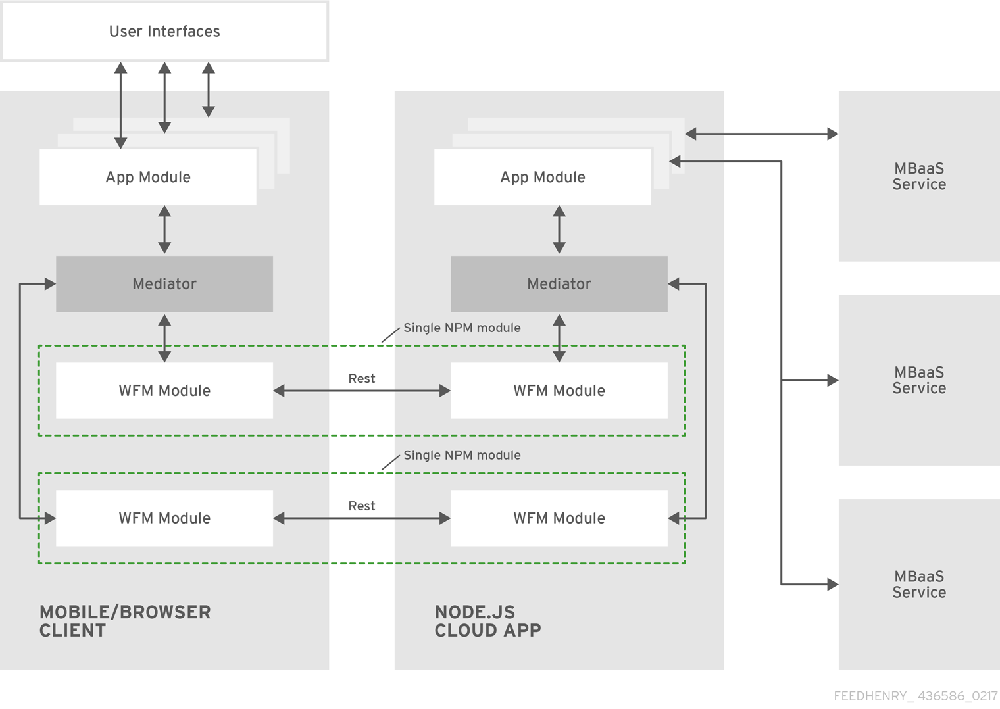

[[getting-started-with-raincatcher]]
= Getting Started with Raincatcher

== Overview

Raincatcher is a set of templates and a field workforce management (WFM) application that connects a business' back-office with its fleet of mobilized employees.  Raincatcher leverages mobile hardware, making use of each employee's mobile phone.

Raincatcher consists of a set of reusable modules that can be included in your application using http://browserify.org/[browserify]. 

Raincatcher modules make use of the
https://addyosmani.com/largescalejavascript/[mediator pattern] to enable
loose coupling between the Raincatcher modules and their consuming
applications / modules as shown in the following diagram:

[[raincatcher-structure]]
== Raincatcher Structure

Raincatcher modules are packaged and distributed using https://www.npmjs.com/[npm] and export as:

* Angular.js directives or services providing client-side functionality for both the mobile and portal clients.
* Express.js routes providing a REST API to be consumed by the
client-side portions of the module.
* FeedHenry sync configurations which enable data synchronization of  module data.

A demonstration is also provided as a project template that shows how the modules can be assembled into an application. See link:The link:demo-solution-architecture.adoc[Demo Solution Architecture] for more information.

[[running-the-raincatcher-demo-apps-in-rhmap]]
== Running the Raincatcher Demo Solution

RHMAP provides a Raincatcher project template to help you run the demonstration.

. Create a Raincatcher project as follows:

..  Log in to the Studio and navigate to the *Projects* area.

..  Click *New Project*.

.. Select the *WFM Demo Project* template, available in the *Tech Preview* category.

.. Enter a name for the project, for example `wfm-demo`.

.. Click *Create*.

.. Click *Finish* at the bottom of the page when the project is created. 

. Create a blank forms theme as follows:

..  Navigate to the *Drag & Drop Apps* area and click *Forms Themes*.
..  Click *New Theme*.
..  Select the *Red Hat Theme*.
..  Name the theme, for example `wfm-theme`.
..  Click *Create*.

. Associate the *Forms theme* with the *WFM Demo Project*:

.. Select the *Projects* header menu item.

.. Open the `wfm-demo` project that you created.

.. Select *Forms* from the project menu.

.. Select the `wfm-theme` theme in the *Project Theme* pulldown.

.. Click *Save*.

. Create an MBaaS Service using the *WFM Auth Service* template:

.. Navigate to the *Services & APIs* area and click *Provision MBaaS Service/API*.

.. Click *Create New Service*.

.. Select the *WFM Auth Service* template, available in the  Authentication category.

.. Name the service, for example `wfm-auth`.

.. Click *Next*.

.. Click *Finish* at the bottom of the page when the service is created. The service details page is displayed.

.. Select *Deploy* from the left menu.

.. Select the target environment from the pulldown list on the right of the page.

.. Click *Deploy Cloud App*.

. Create an auth policy using this new MBaaS service.

.. Navigate to the *Admin* area and click *Auth Policies*.
+
.. Click *Create*.
+
.. Name the policy, for example `wfm-policy`.
+
.. Select the *MBaaS Service* type.
+
// what is the wfm-auth-service?
.. Select the `wfm-auth` service.
+
.. Enter `/api/wfm/user/auth` as the endpoint.
+
// should the default env match the env for cloud app?
.. Select the target default environment. The Validate Settings section appears.
+
.. Enter the  Username `trever` and Password
`123` and click *Validate*.
The response JSON should have a `status` property and the property value of `ok`.
+
.. Click **Create Auth Policy**.

. Associate the *WFM Auth Service* with the *WFM Demo Project*.

.. Navigate to the *Services & APIs* area and select the `wfm-auth` service created earlier.

.. Enter the project name at the bottom of the *Details* page in the *Access Control* section under *Service Settings*: 
... Enter the name of the project, for example,`wfm-demo`.
... Click the *Save Service* button.

.. Set the `FH_SERVICE_AUTHORISED_PROJECTS` environment variable:
... From the left menu, select *Environment Variables*.
+
... Compare the value for `FH_SERVICE_AUTHORISED_PROJECTS` in the _App_ section to
the value in the _System_ section. If the values are different, click the *Push
Environment Variables* button.
image:assets/images/service-env-vars.png[Service Env Vars]
+
.. Set the `WFM_AUTH_GUID` environment variable using the project ID:
+
... From the left-hand side menu, select **Details**.
+
... Click the *Copy* button next to the **Service ID field**.
image:assets/images/copy-service-id.png[Copy Service ID]

... Select the *Projects* header menu item.

... Select the `wfm-demo` project created earlier.
... Select the cloud app.
... From the left-hand side menu, select **Environment Variables**.
... Click **Add Variable**.
image:assets/images/project-add-env-var.png[Project Add Env Var]
... Enter `WFM_AUTH_GUID` for the **name**, and paste in the *Service
ID* copied above for the **value**.
... Click **Push Environment Variables**.
+
.. Set the  `WFM_AUTH_POLICY_ID` environment variable as the auth policy name.
... Select the *Projects* header menu item.
... Select the `wfm-demo` project.
... Select the cloud app.
... From the left-hand side menu, select **Environment Variables**.
... Click **Add Variable**.
... Enter `WFM_AUTH_POLICY_ID` for the **name**, and set the auth policy name created earlier as the **value**, for example, `wfm-policy`.
... Click **Push Environment Variables**.

. Check that the auth service, the cloud app, and the portal
app are all deployed and started.

.. For each of the above mentioned apps, select *Deploy* from the
left-hand side menu.

.. Ensure that the most recent deployment has a *result* of
**Success**. 

.. If it does not indicate success, click *Deploy Cloud App* and verify the deployment is successful.

The apps are now created, configured, and deployed. 

To check the web app deployment in RHMAP:

.  Select the *Projects* header menu item.
+
.  Select the *wfm-demo* project.
+
.  Select the web app.
+
.  From the left-hand side menu, select **Details**.
+
.  Click **Current Host**.
+
.  Login with user *trever* and password **123**.

link:running-locally.adoc[Running the Raincatcher demo solution
locally] describes how to set up your local environment for Raincatcher development.

link:Module-Integration.adoc[Module Integration] explains how to introduce a new module to the solution providing extra
functionality.
